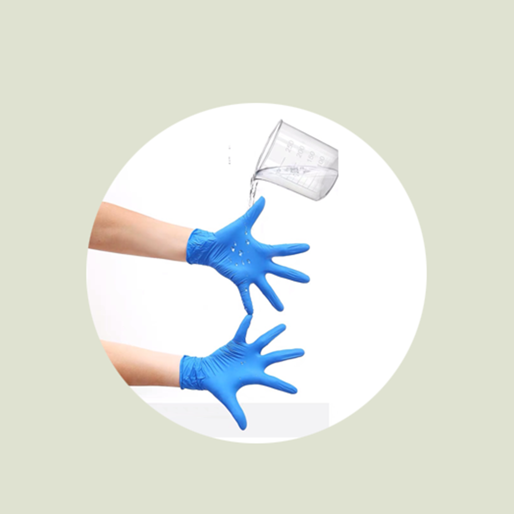

## Welcome to My Household Glove Use Record

We often use all kinds of gloves in our daily life, but are you and your family members familiar with their functions and uses? For example, what kind of gloves should be used when cleaning furniture with serious oil pollution? Which kind of gloves should be used when washing dishes? In order to make it easier for you and your family to get familiar with home gloves more quickly, you can record the usage habits of each time you use home gloves, the model and function of gloves, etc. You can organize these records into a list to facilitate family members to check when using gloves, and avoid unnecessary troubles caused by unfamiliar with household gloves.

If you have any questions, you can either leave a message or send the questions to our email address.

We will answer them for you in the first time.

### Address: BeatriceArlenexSgPdE@yahoo.com

Thank you!
